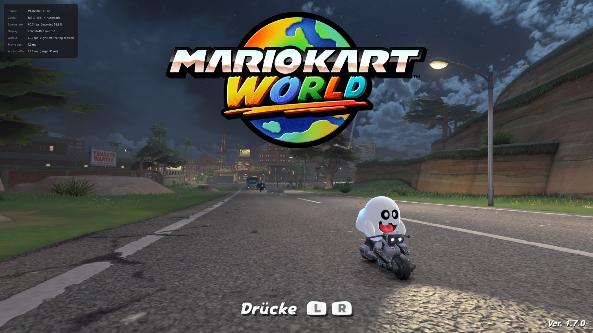
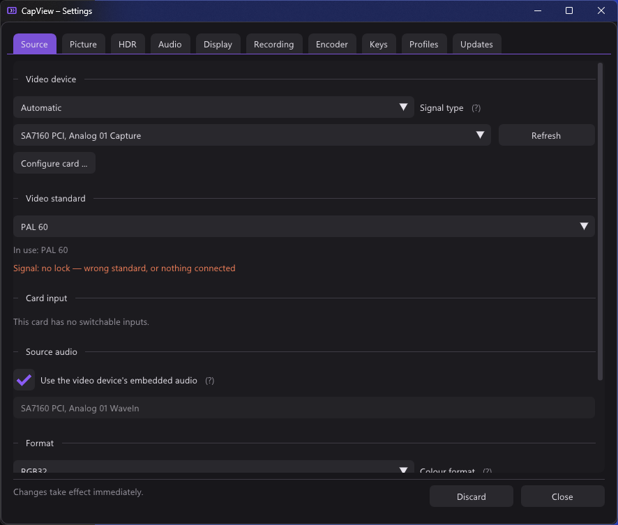
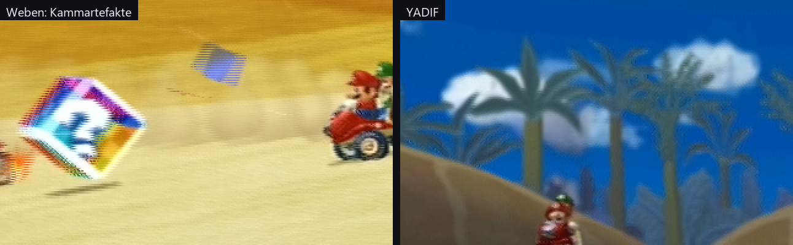
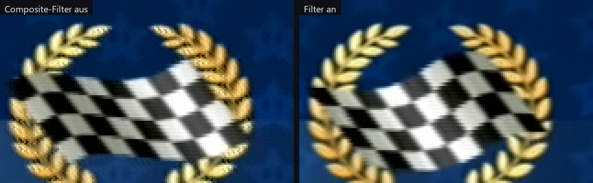
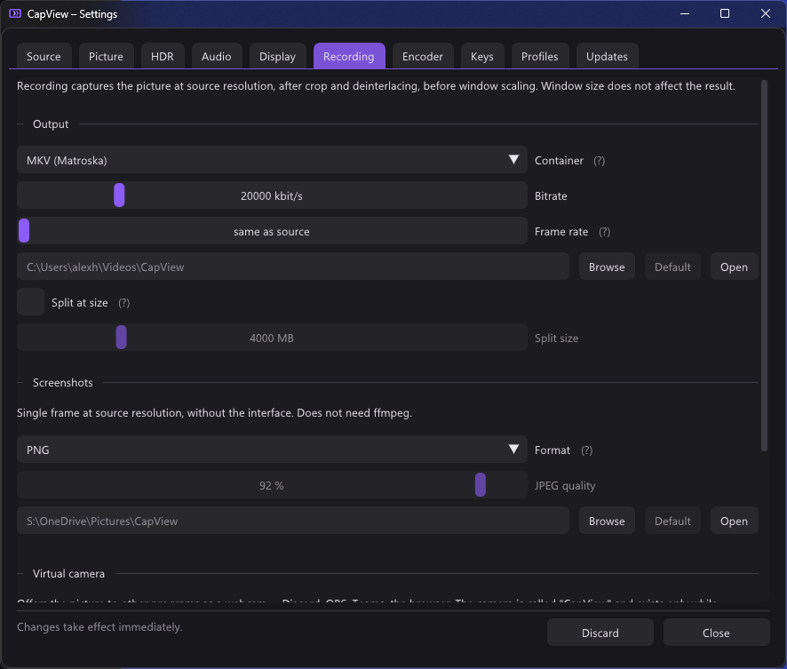

<p align="center">
  
</p>

<h1 align="center">CapView</h1>

<p align="center">
  A low-latency viewer and recorder for DirectShow capture cards on Windows.
</p>



CapView displays the output of a capture card with as little delay as the
hardware allows, so the captured signal can be played on directly rather than
only watched. Measured on a StarTech PEXHDCAP60L: **1080p60 sustained, around
1 ms between a frame arriving from the card and being drawn.**

It is meant for using a capture card to play. Recording, screenshots, a
microphone track and a virtual camera are included; scenes, overlays,
compositing and streaming are not. For those, use OBS.

It covers the same ground as AmaRecTV, whose last release with a bundled
recording codec was version 3.10 in 2014.

> **The [wiki](../../wiki) is the detailed documentation** — one page per
> feature, covering what the code does, why it works that way, and what was
> measured to arrive at it.

## Latency

Four decisions account for the measured figure.

- **No queue in the capture path.** The capture filter copies each frame into a
  triple buffer and returns immediately. Frames arriving faster than they can be
  shown are dropped rather than buffered, so delay cannot accumulate.
- **No graph clock.** The DirectShow graph runs without a reference clock, so
  frames are not held back until a presentation time.
- **Flip-model swap chain**, maximum frame latency of one, tearing permitted.
  VSync is off by default.
- **Format conversion on the GPU.** YUY2, UYVY, YVYU, NV12, planar 4:2:0, RGB
  and P010 are unpacked in a pixel shader rather than on the CPU.

Details: [Latency](../../wiki/Latency).

## Features

### Source

Any DirectShow video device. Resolution, frame rate, pixel format and colour
space are selected independently, so combinations a driver does not advertise
but does accept can be forced — which covers the common case of a card reporting
only 1080p30 for a mode it will in fact deliver at 1080p60.

Cards with an analogue decoder also expose their **video standard** — PAL,
PAL-60, NTSC, SECAM and the rest. On a console that can do both 50 and 60 Hz
this matters: PAL is 625 lines at 50, PAL-60 is 525 at 60, and the wrong one
gives either no picture or one with the wrong number of lines. An automatic mode
cycles the plausible standards and keeps the first that locks.

Whatever the driver keeps to itself is reachable through **Configure card**,
which opens the driver's own property pages while the picture keeps running.

When nothing is coming in, the viewer says so. That is measured from the pixels
rather than from whether frames arrive, because an analogue card with nothing
connected keeps delivering frames regardless — and no signal on composite is not
black but snow, which a naive darkness test would read as picture.

More: [Source and signal](../../wiki/Source-and-signal),
[Signal detection](../../wiki/Signal-detection).



### Picture

Nearest, bilinear, Catmull-Rom, Lanczos3 and sharp-bilinear scaling; contrast
adaptive sharpening; aspect override and integer scaling; rotation in quarter
turns; line doubling for 240p and 288p sources.

Crop is set by dragging the edges, or found for you: **Detect** measures where
the black border ends, as a union across about two seconds so a fade to black is
not read as the picture getting smaller.

Colour range and matrix default to automatic. The range is measured from the
image rather than inferred from the pixel format, because it is a property of
the source signal: a console set to full range delivers full range whether the
card is asked for NV12 or RGB32.

More: [Scaling and sharpening](../../wiki/Scaling-and-sharpening),
[Cropping and geometry](../../wiki/Cropping-and-geometry),
[Colour range and matrix](../../wiki/Colour-range-and-matrix).

### Deinterlacing

Whether the source is interlaced is measured rather than believed — a media type
is entitled to say so and frequently does not. Five modes, and they differ in
more than sharpness. The figures are vertical movement between consecutive
frames, measured on a 480i console:

| Mode | Vertical movement | |
|---|---|---|
| Off (weave) | none | combing on anything that moves |
| Bob | **1.0 line** | full rate, no latency, no interpolation |
| Bob interpolated | 0.56 | the alternation between sharp and interpolated lines |
| Motion adaptive | **0.005** | weaves what is still, interpolates what is not |
| Edge directed | 0.69 | follows edges; meant for pixel art |
| YADIF | **0.002** | best quality; keeps one frame in memory |



More: [Deinterlacing](../../wiki/Deinterlacing).

### Composite

A composite signal carries colour and brightness on one wire, and the two leak
into each other: dot crawl along colour edges, rainbow shimmer over fine detail.

Two controls address the dot crawl and hand over to each other. A **four-frame
average** removes it wherever the picture is standing still, at no cost in
sharpness. A **synchronous demodulator** — a slider — handles what is moving,
reconstructing the colour subcarrier out of the brightness and subtracting it,
which costs some horizontal sharpness. The averaging locks on whenever the
demodulator is used, so it never pays for what is already free.



Colour shimmer is handled separately, by averaging the colour sideways — which
composite carries at a quarter of the bandwidth anyway, so it costs no real
detail. Each neighbour is weighted by how close its colour is to the centre's,
because an unweighted average across a colour edge turns complementary
neighbours into grey.

The subcarrier frequency follows from the video standard, so the Source tab
matters here too. SECAM is not handled by the demodulator; the averaging still
applies.

More: [The composite filter](../../wiki/The-composite-filter).


### High dynamic range

P010 and P016 sources are read against either PQ (ST 2084) or HLG (BT.2100) and
turned into linear light. An ordinary screen gets BT.2390 tone mapping; an HDR
screen gets scRGB.

Recording, screenshots and the virtual camera each get the tone mapped picture
by default, and each can be told to keep the range instead — ten bit P010 for a
recording, JPEG XR or AVIF for a screenshot, ten bit P010 for the camera.

More: [High dynamic range](../../wiki/High-dynamic-range).


### Audio

The card's embedded audio, or any Windows recording device, played out through
WASAPI. The buffer target is configurable, exclusive mode is optional, and an
A/V offset is available. Drift between the capture and playback clocks is
corrected by nudging the playback rate by a fraction of a per cent.

An optional microphone is recorded as a separate input with its own gain, and is
never played back. By default the file gets three tracks: a mix, plus the
capture and microphone separately.

More: [Audio](../../wiki/Audio).

### Recording

H.264, H.265 or AV1 through NVENC, Quick Sync, AMF, x264 or x265, encoded by
ffmpeg. The recording is made at source resolution, after crop and deinterlacing
and before window scaling, so window size does not affect the result.

The capture audio serves as the master clock and the video timeline is derived
from the number of audio samples written, so the output is constant frame rate
and does not drift: measured at 1 ms over 15 seconds.

More: [Recording](../../wiki/Recording).

### Encoder settings

Rate control, preset, tuning, look-ahead, adaptive quantisation and multipass
are exposed under one set of names and translated into each vendor's own.
Everything defaults to automatic, which passes nothing at all rather than
passing the encoder's default. Anything a given encoder has no opinion about is
greyed out rather than hidden.

More: [Encoder settings](../../wiki/Encoder-settings).


### Virtual camera

The picture can be offered to other programs as a webcam under the name
*CapView*, at 1080p, 720p or 480p in NV12. Built on Media Foundation, which
reaches strictly more programs than DirectShow: the Windows Camera app, packaged
apps and the current Teams see only frame-server cameras.

The cost is **Windows 11** (build 22000), and a one-time install with a UAC
prompt, because Windows loads the media source into a service and it has to be
registered machine-wide. There is an uninstall button next to it.

More: [Virtual camera](../../wiki/Virtual-camera).



### Screenshots and profiles

Screenshots are PNG or JPEG at source resolution, taken before the interface is
drawn, and written through Windows Imaging Component — so no ffmpeg is required.

A profile holds the device, input, capture format and all picture and audio
settings. One per source, selected with Ctrl+1 to Ctrl+9.

### Updates

*Settings → Updates* compares this build against the newest release on GitHub,
either at startup or on request. Installing replaces `CapView.exe` itself, by
renaming rather than overwriting, and a failed update leaves the program as it
was rather than gone.

More: [Updates](../../wiki/Updates).

## Shortcuts

| Key | Action |
|---|---|
| Enter | Fullscreen |
| Esc | Leave fullscreen |
| F1 | Statistics |
| F2 | Settings |
| F5 | Restart capture |
| F9 | Start / stop recording |
| F10 | Screenshot |
| M | Mute |
| `+` / `-` or mouse wheel | Volume |
| Ctrl+1 … Ctrl+9 | Switch profile |
| Right click | Menu |

All of these except Esc, the profile digits and Alt+F4 can be reassigned under
*Settings → Keys*. The settings themselves can be drawn over the picture or
given a window of their own, which can be moved to a second monitor.

More: [Shortcuts](../../wiki/Shortcuts),
[The settings window](../../wiki/The-settings-window).

## Building

Requires Visual Studio 2022 with the Desktop C++ workload, and CMake. There are
no external dependencies; Dear ImGui is vendored in `third_party/`.

```bash
build.bat
```

The result is `CapView.exe` in the repository root, around 1.6 MB, linked
against the static CRT. `build.bat keep` retains the build tree for incremental
rebuilds, and `build.bat debug` produces a debug configuration.

Settings are stored in `CapView.json` beside the executable; nothing is written
to the registry. Prebuilt executables are attached to each
[release](../../releases).

More: [Building](../../wiki/Building).

## ffmpeg

Recording requires `ffmpeg.exe`. Nothing else does. *Settings → Encoder*
provides a button that downloads a static build, verifies its published SHA-256
and extracts only the executable. The same is available from the command line:

```bash
CapView.exe --fetch-ffmpeg
```

Available encoders are determined by test-encoding two frames with each
candidate, rather than by reading `ffmpeg -encoders`, which lists what the build
was compiled with rather than what the hardware supports.

More: [ffmpeg](../../wiki/ffmpeg).

## Limitations

- **A card grants its capture pin to one process at a time.** If OBS holds it,
  CapView cannot open it, and the other way round.
- **The virtual camera needs Windows 11.** `MFCreateVirtualCamera` does not
  exist before build 22000.
- **The HDR display path is untested on real HDR hardware.** The maths is
  checked against the standards and the tone mapped path is verified; the scRGB
  output has never been run against an HDR monitor.
- **SECAM dot crawl** is only handled by the temporal half of the composite
  filter.

## Why DirectShow

Capture cards that ship a Media Foundation driver also expose a DirectShow
interface, since both sit on the same Kernel Streaming layer. The reverse does
not hold: older and semi-professional cards are frequently DirectShow only. On
the development machine, DirectShow enumerates five video devices where Media
Foundation enumerates three.

## Licence

CapView is [MIT](LICENSE) licensed. Dear ImGui is MIT licensed as well.

ffmpeg is a separate program, downloaded from upstream and executed as a child
process. The usual Windows builds contain x264 and x265 and are therefore GPL
licensed; invoking a program is not linking against it, so those terms do not
extend to CapView. Redistributing CapView together with an ffmpeg build is a
different matter, and the GPL then applies to what is being distributed.
