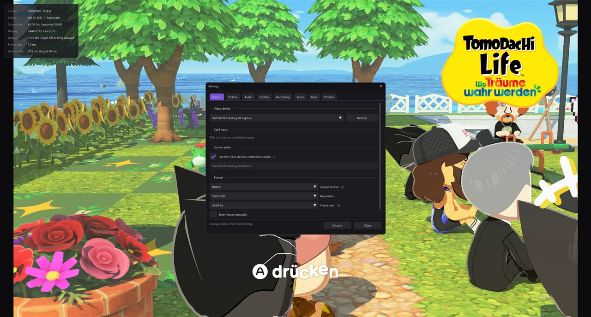
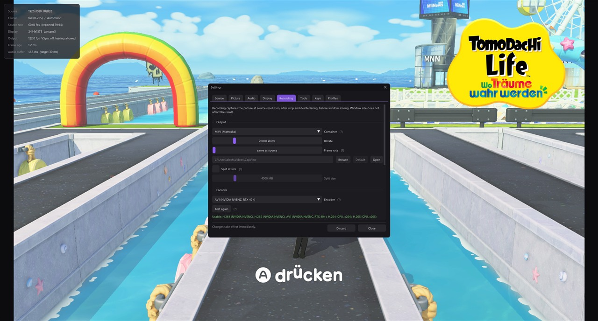

<p align="center">
  
</p>

<h1 align="center">CapView</h1>

<p align="center">
  A low-latency viewer and recorder for DirectShow capture cards on Windows.
</p>


CapView displays the output of a capture card with as little delay as the
hardware allows, so the captured signal can be played on directly rather than
only watched. Measured on a StarTech PEXHDCAP60L: **1080p60 sustained, around
1 ms between a frame arriving from the card and being drawn.**

It is meant for using a capture card to play. Recording, screenshots and a
microphone track are included; scenes, overlays, compositing and streaming are
not. For those, use OBS.

It covers the same ground as AmaRecTV, whose last release with a bundled
recording codec was version 3.10 in 2014.

## Latency

Four decisions account for the measured figure.

- **No queue in the capture path.** The capture filter copies each frame into a
  triple buffer and returns immediately. Frames arriving faster than they can be
  shown are dropped rather than buffered, so delay cannot accumulate.
- **No graph clock.** The DirectShow graph runs without a reference clock, so
  frames are not held back until a presentation time.
- **Flip-model swap chain**, maximum frame latency of one, tearing permitted.
  VSync is off by default.
- **Format conversion on the GPU.** YUY2, UYVY, YVYU, NV12, planar 4:2:0 and RGB
  are unpacked in a pixel shader rather than on the CPU.

## Features

### Source

Any DirectShow video device. Resolution, frame rate, pixel format and colour
space are selected independently. Combinations a driver does not advertise but
does accept can be forced, which covers the common case of a card reporting only
1080p30 for a mode it will in fact deliver at 1080p60.

Cards with an analogue decoder also expose their **video standard** — PAL,
PAL-60, NTSC, SECAM and the rest of the list the driver reports. This matters
more than it looks on a console that can do both 50 and 60 Hz: PAL is 625 lines
at 50, PAL-60 is 525 at 60, and setting the wrong one gives either no picture at
all or one with the wrong number of lines in it. The setting can also be left on
automatic, which cycles the plausible standards and keeps the first that locks.

That automatic mode has a limit worth stating: the only measurement a card offers
is whether its decoder has locked, and on this hardware some standards report a
lock with nothing connected at all. It cannot tell "no signal" from "right
standard", so the tab shows which one it settled on rather than leaving you to
guess.

Whatever the driver keeps to itself — input selection, decoder tuning, the
vendor's own controls — is reachable through **Configure card**, which opens the
driver's own property pages. The picture keeps running while they are open.



### Picture

Nearest, bilinear, Catmull-Rom, Lanczos3 and sharp-bilinear scaling; contrast
adaptive sharpening; aspect override and integer scaling; rotation in quarter
turns; line doubling for 240p and 288p sources that arrive half as tall as they
should.

Crop is set by dragging the edges on the picture, or found for you: **Detect**
measures where the black border ends. A row counts as picture only when a decent
stretch of it is above black and a column only when it is lit in enough of those
rows, so one bright speck of analogue noise in the letterbox does not widen the
result. The measurement is a union across about two seconds, because a fade to
black is not evidence that the picture got smaller.

Rotation and line doubling are applied before scaling, so they appear in
recordings and screenshots as well as in the window.

Colour range and matrix default to automatic. The range is measured from the
image rather than inferred from the pixel format, because it is a property of
the source signal: a console set to full range delivers full range whether the
card is asked for NV12 or RGB32.

### Deinterlacing

Whether the source is interlaced is also measured rather than believed. A media
type is entitled to say so and frequently does not — a plain `VIDEOINFOHEADER`
has nowhere to put it — so two questions are asked of the picture instead. First,
do the two rows of a pair hold the same line? A 240p or 288p console packed into
an interlaced frame arrives that way, and such a source needs its fields
separated but *not* the half-line offset a real interlaced signal has. Second,
only if the answer is no: is there combing? That one needs motion, so it is
judged per frame and never frozen on "progressive" — a still picture proves
nothing.

Five modes, and they differ in more than sharpness. The figures below are the
vertical movement between consecutive frames, measured on a 480i console:

| Mode | Vertical movement | |
|---|---|---|
| Off (weave) | none | combing on anything that moves |
| Bob | **1.0 line** | full rate, no latency, no interpolation |
| Bob interpolated | 0.56 | the alternation between sharp and interpolated lines, not the picture moving |
| Motion adaptive | **0.005** | weaves what is still, interpolates what is not |
| Edge directed | 0.69 | follows edges; meant for pixel art, weakest on composite |
| YADIF | **0.002** | best quality; keeps one frame in memory |

Plain bob doubles each line of the field being shown, and the two fields sit half
a line apart — a distance nearest-neighbour doubling cannot represent. Either the
block boundaries move or the content does, and the measured line is the former.
On a 240p or 288p source, where the fields are not offset at all, this does not
arise and bob is the sharpest option available.

Field order is asked of the media type first and can be overridden, because
guessing wrong does not soften the picture, it makes it judder.

### Composite

A composite signal carries colour and brightness on one wire, and the two leak
into each other. What comes out is dot crawl — the crawling dotted zip along
colour edges — and rainbow shimmer over fine detail. One slider addresses both,
in two halves that hand over to each other.

Where nothing is moving, four consecutive frames are averaged. Four, because the
colour subcarrier walks through a four-frame sequence: measured on a PAL-60
console, the mean difference between frames runs 1.91 at a lag of one frame, 2.62
at two, 1.90 at three and **0.78 at four**. Averaging two frames therefore cancels
nothing; averaging four covers exactly one cycle and what is left is the picture.
This half costs no sharpness at all.

Four covers every standard, not just the one it was measured on. A console
generates its line timing and its subcarrier from the same clock, so the phase
walk per frame is a fixed fraction of a turn, and which fraction depends on the
colour system rather than on the frame rate:

| | Phase per frame | Sequence | Left after 2 frames | after 4 |
|---|---|---|---|---|
| PAL B/G/I, 50 Hz | 270° | 4 frames | 0.71 | **0.00** |
| PAL-60 | 270° (measured) | 4 frames | 0.71 | **0.00** |
| PAL-M | 90° | 4 frames | 0.71 | **0.00** |
| NTSC-M | 180° | 2 frames | 0.00 | **0.00** |

So a 50 Hz PAL console behaves exactly like the 60 Hz one this was built
against — same colour system, same four-frame walk — and NTSC repeats twice as
fast, which four frames also covers. The only difference 50 Hz makes is that four
frames span 160 ms instead of 133, so the "nothing is moving here" judgement has
to hold for a little longer.

Where something is moving there is nothing to average, so the carrier is worked
back out of the brightness instead. Multiplying the line by the subcarrier and by
the same carrier a quarter cycle over moves the pattern down to nothing, a short
average recovers how much of it is there, and multiplying back up reconstructs it
to be subtracted. Picture detail is not tied to the carrier's phase and survives.
The slider sets the width of that average:

| Window | 25 | 15 | 11 | 9 | 7 | 5 |
|---|---|---|---|---|---|---|
| Pattern removed | 42 % | 61 % | 74 % | 81 % | 90 % | 99 % |
| Horizontal sharpness | −7 % | −11 % | −14 % | −17 % | −25 % | −39 % |

The subcarrier frequency follows from the video standard and the line width, so
nothing has to be detected for this: 4.433619 MHz for PAL and its relatives,
3.579545 MHz for NTSC, against BT.601 sampling.

That window is counted in cycles of the carrier rather than in pixels, which
matters because the two are not the same thing: NTSC's carrier occupies 3.77
samples of a 720 pixel line where PAL's occupies 3.04. A window fixed at a pixel
count therefore hands NTSC a fifth fewer cycles to work with. Simulated against
an amplitude modulated pattern — which is what dot crawl is, since it only
appears where there is a colour edge — that cost NTSC 61 % removal at the far end
of the slider where PAL got 69 %, and it invented a quarter more pattern of its
own doing it. Counted in cycles the two land at 67 % and 72 %. The same scaling
covers capture widths other than 720.

The standard therefore has to be set correctly for this half to do its job, which
is a reason to care about the Source tab beyond getting a picture at all. With
the carrier assumed wrong — PAL's filter against an NTSC signal or the reverse —
removal falls from about 70 % to 34 % at the middle of the slider.

SECAM is the exception and is not handled: its colour is frequency modulated on
two carriers that alternate line by line, so there is no single frequency to
demodulate against. The temporal half still applies.

This is where composite restoration generally stops. The established offline
filters — TComb, DeDot, LUTDeCrawl, Checkmate — are all temporal and say so
themselves about moving content. Going further needs motion compensation of the
QTGMC sort, which is not a real-time proposition.

### Audio

The card's embedded audio, or any Windows recording device, played out through
WASAPI. The buffer target is configurable, exclusive mode is optional, and an
A/V offset is available. Drift between the capture and playback clocks is
corrected continuously by adjusting the playback rate by a fraction of a per
cent. Both inputs have level meters.

An optional microphone is recorded as a separate input with its own gain. It is
never played back. By default the file receives three audio tracks: a mix, plus
the capture and microphone separately. Mixed-only and separate-only are also
available.

### Recording

H.264, H.265 or AV1 through NVENC, QuickSync, AMF, x264 or x265, encoded by
ffmpeg. The recording is made from the picture at source resolution, after crop
and deinterlacing and before window scaling, so window size does not affect the
result.

The capture audio serves as the master clock, and the video timeline is derived
from the number of audio samples written. The output is therefore constant frame
rate and does not drift: measured at 1 ms over 15 seconds.



### Screenshots

PNG or JPEG at source resolution, taken before the interface is drawn. Written
through Windows Imaging Component, so no ffmpeg is required.

### Profiles

A profile holds the device, input, capture format and all picture and audio
settings. One per source, selected with Ctrl+1 to Ctrl+9.

### High dynamic range

A card that can carry HDR sends P010 or P016 — ten or sixteen bits of luma per
sample rather than eight — encoded against one of two curves. Both are read.

**PQ** (SMPTE ST 2084, what HDR10 uses) states outright how many nits a code
means, from nothing up to ten thousand. **HLG** (BT.2100) states it relative to
whatever the display can manage, and needs a system gamma applied on top. Either
way the picture is turned into linear light with 1.0 meaning diffuse white, and
BT.2020 primaries are brought back to BT.709. The maths was checked against the
standards before it was written: PQ 0.5 comes out at 92.246 nits where ST.2084
says 92.245, and HLG lands exactly on its three defined points.

Which curve is in use is normally read from the media type — the driver puts it
in `DXVA_ExtendedFormat`, and transfer function 15 is PQ, 16 is HLG. Most cards
put nothing there at all, so it can be set by hand.

What happens next depends on the screen, not the source:

- **An ordinary screen** cannot show a thousand nit highlight and has to be told
  a smaller story about it. The tone mapping is the curve from BT.2390, applied
  in the PQ domain because PQ is roughly perceptually even and that is where a
  knee belongs: straight below the knee so ordinary content passes through
  untouched, a Hermite spline above it so highlights compress instead of
  clipping to a flat white. Brightness is mapped and colour carried along rather
  than running the curve per channel, which would pull saturated highlights
  towards white.
- **An HDR screen** is handed scRGB — half float, linear, 1.0 fixed at eighty
  nits — so highlights simply carry on past one. The interface is drawn into a
  buffer of its own and converted on the way, because it is written in sRGB and
  handing those numbers to a linear target would show every grey in it wrong by
  the difference between the two.

Two settings are worth understanding rather than guessing at. **Paper white** is
how bright ordinary white comes out; 203 nits is what BT.2408 recommends and
what most material is graded against. **Source peak** is how bright the source
gets at its brightest — and DirectShow carries no mastering metadata anywhere,
so there is nothing to read it from. It matters more than it sounds: assume
10000 where the content only reaches 1000 and paper white lands at 63 instead of
88 out of 100 nits on an ordinary screen, darkening everything. 1000 is the
default because that is where consoles sit.

Recording is still SDR. What goes to the recorder is the tone mapped picture,
not the original range.

### Virtual camera

The picture can be offered to other programs as a webcam — Discord, OBS, Teams,
a browser — under the name *CapView*. It is switched on in *Settings → Tools*
and exists only while CapView is running.

It is built on Media Foundation rather than DirectShow, because that reaches
strictly more programs. Measured on one machine with several virtual cameras
installed:

| | DirectShow | Media Foundation |
|---|---|---|
| OBS Virtual Camera | yes | **no** |
| Camera (NVIDIA Broadcast) | yes | **no** |
| CapView | yes | yes |
| real cameras (webcam, capture card) | yes | yes |

A DirectShow virtual camera is genuinely absent from Media Foundation, while one
registered through `MFCreateVirtualCamera` appears in both — Windows bridges
frame-server cameras into DirectShow enumeration, and not the other way about.

That does not mean a DirectShow camera reaches nothing modern. Chromium
enumerates both backends, so Discord, Chrome and Edge see OBS's camera perfectly
well. What it cannot reach is anything that goes only through the frame server:
the Windows Camera app, the camera list in Settings, packaged apps, Windows
Hello, and the current Teams. Media Foundation is the superset, which is the
whole of the argument.

The cost of that choice is **Windows 11** (build 22000), where
`MFCreateVirtualCamera` first appeared. There is no equivalent before it.

Installing is a separate, one-time step with a UAC prompt, and there is a button
next to it to undo it. The reason is structural rather than fussy: Windows loads
the camera's media source into the Frame Server *service*, not into CapView, so
it has to be registered machine-wide — a per-user registration would not be
visible to the account that has to load it. Using the camera afterwards needs no
rights at all.

Because the two halves live in different sessions, the pictures travel through a
named section in the global object namespace. Creating one needs a privilege an
ordinary account does not have and a service does, so the media source creates
it and CapView opens it — which also means the section only exists while
something is actually reading the camera, and CapView does no work at all until
then. Each picture is published under a sequence number that is odd while it is
being written, so a reader can tell a torn copy from a whole one without either
side ever waiting for the other.

The camera offers 1920×1080, 1280×720 and 640×480 in NV12 at 30 fps, and the
consumer picks. Whatever it picks is what CapView renders into, with the picture
keeping its shape and black bars filling the rest — a 4:3 console in a 16:9
camera is pillarboxed rather than stretched.

Note that this makes a release two files: `CapView.exe` and `capview_vcam.dll`
have to sit in the same folder, and they have to be from the same build. The
update check downloads only the executable, and Windows keeps the DLL locked
while the camera is in use anywhere on the machine, so the two really can drift
apart. Both halves therefore check that they agree about the shape of what they
share, and say so plainly if they do not — the alternative symptom is a black
picture and no explanation, which is worth some trouble to avoid.

If the source needs replacing and Windows will not let go of the file, close
whatever has the camera open; failing that, restarting the *Windows Camera Frame
Server* service releases it.

### Updates

*Settings → Updates* compares this build against the newest release on GitHub,
either once at startup or on request. When the startup check finds something, a
notice says so over the picture — once per session, whatever you do with it.
Nothing is downloaded until you ask; the startup check only asks.

Installing replaces `CapView.exe` itself. Windows will not let a running image be
overwritten but will let it be renamed, so the old build is moved aside, the new
one takes its name, and the next start removes the leftover — no helper process
that can go missing. The download is checked for being a program at all before
anything is moved, and if the second rename fails the first is undone, so a
failed update leaves the program as it was rather than gone.

An installation directory that needs administrator rights to write to will refuse
the swap and say so.

## Shortcuts

| Key | Action |
|---|---|
| Enter | Fullscreen |
| Esc | Leave fullscreen |
| F1 | Statistics |
| F2 | Settings |
| F5 | Restart capture |
| F9 | Start / stop recording |
| F10 | Screenshot |
| M | Mute |
| `+` / `-` or mouse wheel | Volume |
| Ctrl+1 … Ctrl+9 | Switch profile |
| Right click | Menu |

All of these except Esc, the profile digits and Alt+F4 can be reassigned under
*Settings → Keys*.

The settings can be drawn over the picture or given a window of their own, which
can then be moved to a second monitor or set beside the preview. The switch is
under *Settings → Display → Window*.

The statistics overlay has three levels of detail: frame rates and frame age;
those plus capture format, colour handling and audio buffer; and everything,
including device names and dropped frame counts.

## Building

Requires Visual Studio 2022 with the Desktop C++ workload, and CMake. There are
no external dependencies; Dear ImGui is vendored in `third_party/`.

```bash
build.bat
```

The result is `CapView.exe` in the repository root, around 1.6 MB, linked
against the static CRT. The build tree is removed afterwards, leaving only the
executable. Settings are stored in `CapView.json` beside it; nothing is written
to the registry.

`build.bat keep` retains the build tree for incremental rebuilds, and
`build.bat debug` produces a debug configuration.

Prebuilt executables are attached to each [release](../../releases).

## ffmpeg

Recording requires `ffmpeg.exe`. Nothing else does. *Settings → Recording*
provides a button that downloads a static build, verifies its published SHA-256
and extracts only the executable. The same operation is available from the
command line:

```bash
CapView.exe --fetch-ffmpeg
```

CapView looks for ffmpeg in `ffmpeg\bin` and `ffmpeg` next to the executable,
then beside the executable itself, then on `PATH`. A specific path can be
configured.

Available encoders are determined by test-encoding two frames with each
candidate, rather than by reading `ffmpeg -encoders`, which lists what the build
was compiled with rather than what the hardware supports. The test runs once, on
request; the result is stored in the configuration and reused on subsequent
starts. It is discarded when the graphics adapter or the ffmpeg build changes.

Two automatic modes are offered, because compatibility and file size pull in
opposite directions:

| Mode | Order | Suited to |
|---|---|---|
| Plays anywhere | H.264, H.265, AV1 | Files that open on any phone, television or editor |
| Smaller files | AV1, H.265, H.264 | The same quality at a fraction of the size |

Hardware encoders precede the CPU encoders in both orders. Each mode takes the
first entry of its order that passed the test.

## Why DirectShow

Capture cards that ship a Media Foundation driver also expose a DirectShow
interface, since both sit on the same Kernel Streaming layer. The reverse does
not hold: older and semi-professional cards are frequently DirectShow only. On
the development machine, DirectShow enumerates five video devices where Media
Foundation enumerates three.

A card grants its capture pin to one process at a time. If OBS holds it, CapView
cannot open it, and the other way round.

HDR recording is not implemented. The display path handles PQ and HLG, but what
reaches the recorder and the screenshots is the tone mapped picture, in eight
bits — the original range is not written out.

HDR needs Windows 10 or later for the display side and offers nothing on a
screen that is not in HDR mode, where the picture is tone mapped instead.

## Licence

CapView is [MIT](LICENSE) licensed. Dear ImGui is MIT licensed as well.

ffmpeg is a separate program, downloaded from upstream and executed as a child
process. The usual Windows builds contain x264 and x265 and are therefore GPL
licensed; invoking a program is not linking against it, so those terms do not
extend to CapView. Redistributing CapView together with an ffmpeg build is a
different matter, and the GPL then applies to what is being distributed.
