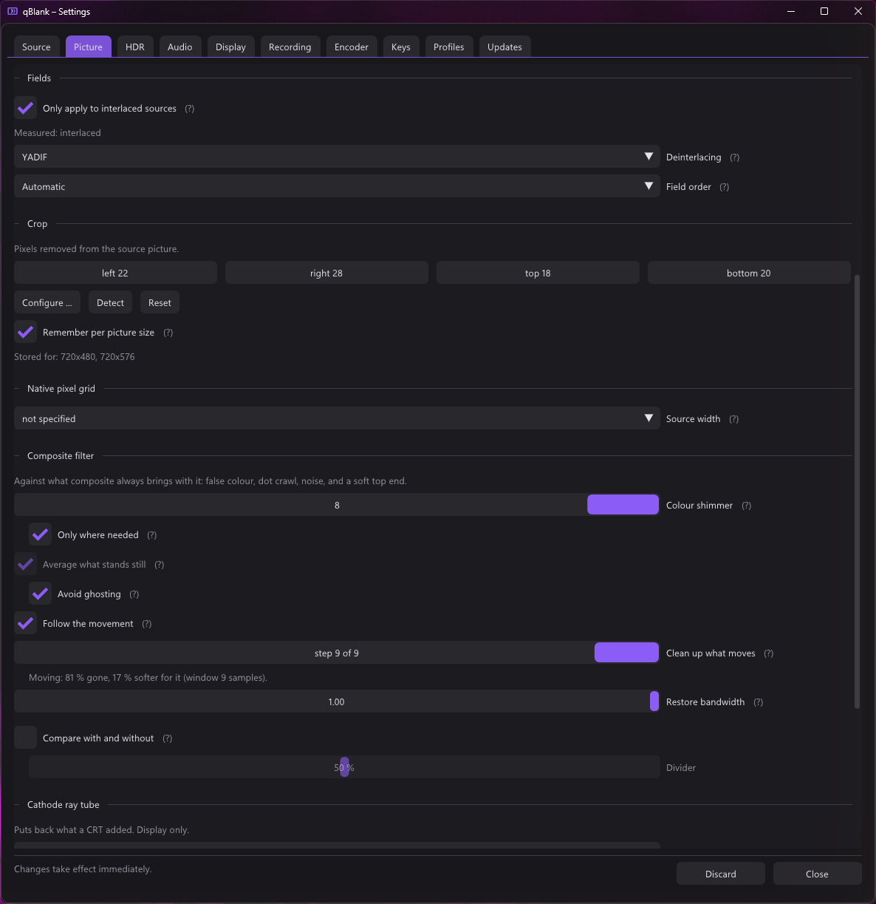

<p align="center">
  
</p>

<h1 align="center">CapView</h1>

<p align="center">
  A low-latency viewer and recorder for DirectShow capture cards on Windows.
</p>


CapView displays the output of a capture card with as little delay as the
hardware allows, so the captured signal can be played on rather than only
watched. Measured on a StarTech PEXHDCAP60L: **1080p60 sustained, around 1 ms
from a frame arriving to the present that hands it to the compositor.**

It is meant for using a capture card to play. Recording, screenshots, a
microphone track and a virtual camera are included; scenes, overlays,
compositing and streaming are not. For those, use OBS.

> **The [wiki](../../wiki) is the documentation** — one page per feature,
> covering what the code does, why it works that way, and what was measured to
> arrive at it. This page is the short version.

## Latency

- **No queue in the capture path.** Each frame goes into a triple buffer and the
  filter returns; frames arriving faster than they can be shown are dropped
  rather than buffered, so delay cannot accumulate.
- **No graph clock**, so frames are not held back until a presentation time.
- **Flip-model swap chain**, maximum frame latency of one, tearing permitted,
  VSync off by default.
- **Format conversion on the GPU.** YUY2, UYVY, YVYU, NV12, planar 4:2:0, RGB
  and P010 are unpacked in a pixel shader rather than on the CPU.

More: [Latency](../../wiki/Latency).

## Features

**Settings follow the source.** They live in a window of their own with its own
Direct3D device, so it can be moved to a second monitor; an embedded panel
remains, because a window capture in OBS cannot see a second window. Controls
that cannot apply to the current source are absent rather than disabled, and are
not applied to the picture either — the native pixel grid and composite filter
on analogue sources, scanlines and mask at 576 lines or fewer, deinterlacing
where there are fields, the HDR curve where the source is not analogue. The test
is the picture rather than the socket: no analogue standard produces more than
576 lines. [The settings window](../../wiki/The-settings-window)

**Source.** Any DirectShow video device. Resolution, frame rate, pixel format
and colour space are selected independently, so combinations a driver does not
advertise but does accept can be forced — which covers the common case of a card
reporting only 1080p30 for a mode it will in fact deliver at 60. Beside the
numbers the rate list carries **highest available** and **the signal's rate**,
both resolved from the card when it is opened rather than stored, so a console
switching from 576i50 to 480p60 needs no one to edit a profile. Analogue cards
also expose their video standard and which cable is in use; the latter is asked
rather than measured, because `IAMCrossbar` is missing on plenty of cards, and
it decides which picture filters exist at all. **Configure card** opens the
driver's own property pages while the picture keeps running. Whether anything is
coming in is measured from the pixels: an analogue card with nothing connected
keeps delivering frames. [Source and signal](../../wiki/Source-and-signal),
[Signal detection](../../wiki/Signal-detection)

**Automatic video standard.** The standard is not chosen once at startup but
kept correct for as long as the program runs, so switching a console from 50 to
60 Hz is followed without touching the settings. A lock pass settles the line
count and the timing; a colour round then measures the picture itself, because
PAL B, PAL N and SECAM all fit 625 lines and the decoder reports a lock for the
wrong one as confidently as for the right one. From a deliberately wrong
standard to a confirmed right one takes 1.7 to 2.4 seconds on the hardware this
was built against. A round that ran on a still-black or moving picture is
refused rather than believed, and **F7** asks for a search by hand — the one
case measurement does not cover is colour that is wrong rather than missing.
Every step is written to `CapView.log` with what was measured.
[Automatic video standard](../../wiki/Automatic-video-standard)

**Picture.** Nearest, bilinear, Catmull-Rom, Lanczos3 and sharp-bilinear
scaling; contrast adaptive sharpening; aspect override, integer scaling and a
square-pixel mode that takes its shape from the console's own grid; rotation in
quarter turns; line doubling for 240p and 288p sources. A **native pixel grid**
setting resolves every output pixel to the console's own rather than to a
fraction of one — a card samples the line 720 times where a SNES drew 256.
Optional scanlines and shadow mask, off by default, display only, each
compensating its own brightness. [Scaling and
sharpening](../../wiki/Scaling-and-sharpening)

**Crop and colour range.** The crop is dragged on the picture or found by
**Detect** (**F8**), which measures the black border as a union across about two
seconds so a fade to black is not read as the picture shrinking, and refuses when
too little would survive. It is a count of source pixels, so it is **dropped**
when the source changes size rather than scaled into a guess — or kept per
picture size, for a console that keeps changing between 50 and 60 Hz. Colour
range and matrix default to automatic, the range measured from the image rather
than inferred from the pixel format, with **F6** to measure again after a change
in the card's own driver. [Cropping and
geometry](../../wiki/Cropping-and-geometry), [Colour range and
matrix](../../wiki/Colour-range-and-matrix)

**Deinterlacing.** Whether the source is interlaced is measured rather than
believed. Vertical movement between consecutive frames, on a 480i console:

| Mode | Vertical movement | |
|---|---|---|
| Off (weave) | none | combing on anything that moves |
| Bob | **1.0 line** | full rate, no latency, no interpolation |
| Bob interpolated | 0.56 | alternates sharp and interpolated lines |
| Motion adaptive | **0.005** | weaves what is still, interpolates what is not |
| Edge directed | 0.69 | follows edges; meant for pixel art |
| YADIF | **0.002** | best quality; keeps one frame in memory |


More: [Deinterlacing](../../wiki/Deinterlacing).

**Composite filter.** Composite carries colour and brightness on one wire, and
the two leak into each other. A **four-frame average** removes dot crawl
wherever the picture stands still at no cost in sharpness; a **synchronous
demodulator** takes over where it moves, at some cost in horizontal sharpness.
**Follow the movement** averages along the path a piece of line took rather than
across it, so a moving picture gets its noise taken off too. Colour shimmer is
handled by a weighted sideways average, optionally only where the brightness
carries energy at the subcarrier's own frequency. **Restore bandwidth** puts back
the top of the band the transmission rolled off, with a filter that places a
second-order null on the subcarrier instead of lifting the dot crawl with it. All
of it is derived while the shader runs from a single number, the subcarrier
period in samples, so it is right for PAL, PAL 60, NTSC, NTSC 4.43, PAL M and
PAL N alike and at any source width. SECAM is approximated.


More: [The composite filter](../../wiki/The-composite-filter).

**High dynamic range.** P010 and P016 sources are read against PQ (ST 2084) or
HLG (BT.2100). An ordinary screen gets BT.2390 tone mapping, an HDR screen
scRGB. Recording, screenshots and the virtual camera each take the tone mapped
picture by default and can be told to keep the range instead — P010, or JPEG XR
and AVIF for a still. [High dynamic range](../../wiki/High-dynamic-range)

**Audio.** The card's embedded audio or any Windows recording device, played out
through WASAPI, with a configurable buffer target, optional exclusive mode and
an A/V offset. Drift between the capture and playback clocks is corrected by
nudging the playback rate by a fraction of a per cent. An optional microphone is
recorded as a separate input and never played back; by default the file gets
three tracks — a mix, plus the capture and microphone separately.
[Audio](../../wiki/Audio)

**Recording.** H.264, H.265 or AV1 through NVENC, Quick Sync, AMF, x264 or x265,
encoded by ffmpeg, at source resolution — after crop and deinterlacing, before
window scaling, so the window size does not affect the result. The capture audio
is the master clock and the video timeline follows the audio samples written, so
the output is constant frame rate and does not drift: 1 ms over 15 seconds. A
console switched from 60 to 50 Hz mid-recording **cuts the file and continues in
a new one** at the new shape. Rate control, preset, tuning, look-ahead, adaptive
quantisation and multipass are exposed under one set of names and translated
into each vendor's own, everything defaulting to automatic.
[Recording](../../wiki/Recording), [Encoder
settings](../../wiki/Encoder-settings)

**Screenshots.** Also at source resolution, and taken **before the interface is
drawn**, so no overlay or panel reaches the file; **Include the interface** saves
the finished window instead. PNG and JPEG go through Windows Imaging Component,
so **no ffmpeg is needed**. An HDR source can keep its range as JPEG XR, which
Windows ships the encoder for and little but the Photos app reads, or as AVIF,
which needs ffmpeg and is read by every browser.
[Screenshots](../../wiki/Screenshots)

**Virtual camera.** The picture is offered to other programs as a webcam called
**CapView Virtual Camera**, at the source's own resolution and rate rather than
from a list of sizes: a 240p SNES goes out as 240p, a 1080p60 Switch as 1080p60.
Programs that cannot take that get one of the ordinary sizes below it, scaled
and letterboxed in their own process. Nothing above the source is offered, since
a camera that advertises more than it has misleads whoever picks the largest
entry. Installing costs one UAC prompt, because a DirectShow filter is
registered machine-wide. **Leave the reading program's resolution on automatic**
— in OBS, *Resolution/FPS Type: Device Default* — because a format is settled
when the camera is opened and kept until it is reopened. [Virtual
camera](../../wiki/Virtual-camera)

**One profile per console.** A profile holds everything: the device, the input,
the video standard, the capture format and every picture and audio setting.
Ctrl+1 to Ctrl+9 switch between them, and **Save current as …** turns whatever
is set up right now into one. Almost nothing carries over between consoles — a
SNES over composite wants the dot crawl filters, a native width of 256 and PAL
at 50 Hz, a Switch over HDMI wants none of that — so this is how the program is
meant to be used. A profile can also say **which video standard means it**, and
the search then picks the profile: the same cable, two consoles, and no
keystroke at all.

**Updates.** *Settings → Updates* compares the build against the newest release
on GitHub. Installing replaces `CapView.exe` by renaming rather than
overwriting, so a failed update leaves the program as it was.
[Updates](../../wiki/Updates)



## Shortcuts

| Key | Action |
|---|---|
| Enter | Fullscreen |
| Esc | Leave fullscreen |
| F1 | Statistics |
| F2 | Settings |
| F5 | Restart capture |
| Shift+F5 | Reinitialise card |
| F6 | Measure colour range again |
| F7 | Detect video standard |
| F8 | Detect border |
| F9 | Start / stop recording |
| F10 | Screenshot |
| M | Mute |
| `+` / `-` or mouse wheel | Volume |
| Ctrl+1 … Ctrl+9 | Switch profile |
| Right click | Menu |

All of these except Esc, the profile digits and Alt+F4 can be reassigned under
*Settings → Keys*. More: [Shortcuts](../../wiki/Shortcuts).

## Building

Requires Visual Studio 2022 with the Desktop C++ workload, and CMake. There are
no external dependencies; Dear ImGui is vendored in `third_party/`.

```bash
build.bat
```

The result is `CapView.exe` in the repository root, about 2 MB, linked against
the static CRT. `build.bat keep` retains the build tree for incremental
rebuilds, `build.bat debug` produces a debug configuration.

Settings are stored in `CapView.json` beside the executable; nothing is written
to the registry. Prebuilt executables are attached to each
[release](../../releases). More: [Building](../../wiki/Building).

## ffmpeg

Two things require `ffmpeg.exe`, and nothing else does: **recording**, whichever
encoder is used, and **HDR screenshots in AVIF**. The preview, the composite
filters, deinterlacing, the virtual camera and SDR screenshots run without it.

*Settings → Encoder* downloads a static build, verifies its published SHA-256
and extracts only the executable; `CapView.exe --fetch-ffmpeg` does the same
from the command line. Available encoders are determined by test-encoding two
frames with each candidate, rather than by reading `ffmpeg -encoders`, which
lists what the build was compiled with rather than what the hardware supports.

More: [ffmpeg](../../wiki/ffmpeg).

## Limitations

- **A card grants its capture pin to one process at a time.** If OBS holds it,
  CapView cannot open it, and the other way round.
- **The virtual camera is not visible to packaged apps.** Its shared memory
  lives in the session namespace, which an app container cannot see — so the
  Windows Camera app and Store builds of Teams do not find it. Everything that
  loads DirectShow normally does: OBS, Discord, browsers, vMix, XSplit.
- **S-Video and component have not been run.** Every measurement behind the
  analogue path was taken on composite, from a PAL SNES and a GameCube. Picking
  either of the others removes filters and skips the colour round, which is the
  safe direction to be wrong in, but the claim that the picture is then correct
  rests on how the signals are defined and not on anything measured here.
- **The HDR display path is untested on real HDR hardware.** The maths is
  checked against the standards and the tone mapped path is verified; the scRGB
  output has never been run against an HDR monitor.
- **SECAM is approximated.** It carries colour as frequency modulation on two
  alternating subcarriers, at 4.250 and 4.40625 MHz, and CapView works from a
  single figure of 4.43362 MHz. The demodulator does not handle SECAM at all;
  the four-frame average, the noise filter and the bandwidth restore do, and it
  has not been measured against a SECAM source.

## Why DirectShow

Capture cards that ship a Media Foundation driver also expose a DirectShow
interface, since both sit on the same Kernel Streaming layer. The reverse does
not hold: older and semi-professional cards are frequently DirectShow only. On
the development machine, DirectShow enumerates five video devices where Media
Foundation enumerates three.

## Licence

CapView is [MIT](LICENSE) licensed, as is Dear ImGui; the components and their
terms are listed in [THIRD-PARTY.md](THIRD-PARTY.md).

ffmpeg is a separate program, downloaded from upstream and executed as a child
process. The usual Windows builds are GPL licensed, and invoking a program is
not linking against it — but redistributing CapView together with an ffmpeg
build is a different matter, and the GPL then applies to what is distributed.
