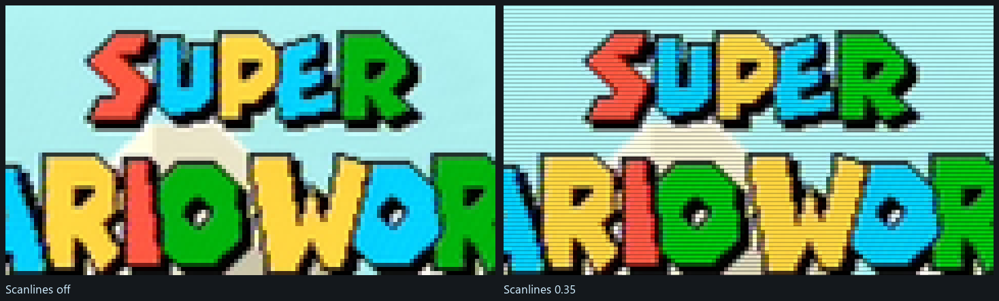

<p align="center">
  
</p>

<h1 align="center">qBlank</h1>

<p align="center">
  A low-latency viewer and recorder for DirectShow capture cards on Windows.
</p>


qBlank shows a capture card's output with as little delay as the hardware
allows, so the signal can be played on rather than only watched. Measured on a
StarTech PEXHDCAP60L: **1080p60 sustained, around 1 ms from a frame arriving to
the present that hands it to the compositor.**

Recording, screenshots, a microphone track and a virtual camera are included;
scenes, overlays, compositing and streaming are not. For those, use OBS.

> **The [wiki](../../wiki) is the documentation** — one page per feature, what
> the code does and what was measured to arrive at it. This page is the short
> version.

## Latency

- **No queue in the capture path.** Each frame goes into a triple buffer and the
  filter returns; frames arriving faster than they can be shown are dropped
  rather than buffered, so delay cannot accumulate.
- **No graph clock**, so frames are not held back until a presentation time.
- **Flip-model swap chain**, maximum frame latency of one, tearing permitted,
  VSync off by default.
- **Format conversion on the GPU.** YUY2, UYVY, YVYU, NV12, planar 4:2:0, RGB
  and P010 are unpacked in a pixel shader rather than on the CPU.

More: [Latency](../../wiki/Latency).

## Features

**Source** — any DirectShow video device. Resolution, frame rate, pixel format
and colour space are chosen independently, so combinations a driver does not
advertise but does accept can be forced. The rate list also carries *highest
available* and *the signal's rate*, resolved from the card rather than stored.
Analogue cards expose their video standard and which cable is in use; **Configure
card** opens the driver's own property pages while the picture keeps running.
[Source and signal](../../wiki/Source-and-signal), [Signal
detection](../../wiki/Signal-detection)

**Automatic video standard** — kept correct for as long as the program runs, not
chosen once at startup, so switching a console from 50 to 60 Hz is followed
without touching the settings. A colour round measures the picture itself,
because PAL B, PAL N and SECAM all fit 625 lines. From a wrong standard to a
confirmed right one takes 1.7 to 2.4 seconds; **F7** searches by hand.
[Automatic video standard](../../wiki/Automatic-video-standard)

**Picture** — nearest, bilinear, Catmull-Rom, Lanczos3 and sharp-bilinear
scaling; contrast adaptive sharpening; brightness, contrast, saturation and hue;
aspect override, integer scaling and a square-pixel mode; rotation in quarter
turns; line doubling for 240p and 288p. A **native pixel grid** setting resolves
every output pixel to the console's own — a card samples the line 720 times where
a SNES drew 256. [Scaling and sharpening](../../wiki/Scaling-and-sharpening)

**Crop and colour range** — the crop is dragged on the picture or found by
**Detect** (**F8**), measured as a union across about two seconds so a fade to
black is not read as the picture shrinking. It counts source pixels, so it is
dropped when the source changes size rather than scaled into a guess — or kept
per picture size. Range and matrix default to automatic and are measured from the
image, with **F6** to measure again. [Cropping and
geometry](../../wiki/Cropping-and-geometry), [Colour range and
matrix](../../wiki/Colour-range-and-matrix)

**Deinterlacing** — whether the source is interlaced is measured rather than
believed. Vertical movement between consecutive frames, on a 480i console:

| Mode | Vertical movement | |
|---|---|---|
| Off (weave) | none | combing on anything that moves |
| Bob | **1.0 line** | full rate, no latency, no interpolation |
| Bob interpolated | 0.56 | alternates sharp and interpolated lines |
| Motion adaptive | **0.005** | weaves what is still, interpolates what is not |
| Edge directed | 0.69 | follows edges; meant for pixel art |
| YADIF | **0.002** | best quality; keeps one frame in memory |


More: [Deinterlacing](../../wiki/Deinterlacing).

**Composite filter** — composite carries colour and brightness on one wire, and
the two leak into each other. A **four-frame average** removes dot crawl wherever
the picture stands still at no cost in sharpness, a **synchronous demodulator**
takes over where it moves, and **follow the movement** averages along the path a
piece of line took. Colour shimmer is handled by a weighted sideways average, and
**restore bandwidth** puts back the top of the band the transmission rolled off.
All of it is derived while the shader runs from the subcarrier period in samples,
so it is right for PAL, PAL 60, NTSC, NTSC 4.43, PAL M and PAL N alike and at any
source width. SECAM is approximated.


More: [The composite filter](../../wiki/The-composite-filter).

**Cathode ray tube** — scanlines and a phosphor mask, off by default and display
only: a recording, a screenshot and the virtual camera take the picture from
upstream of this pass. The gaps follow the **source's** line grid rather than the
screen's and are absent where there is no room, in which case the control says so
with the figure it is working from. **Source lines** is where you say what the
console actually drew, for a card or dongle that hands over 1080 lines from a
480-line console. The mask is an aperture grille or a shadow mask; both put back
the brightness they take. More: [Scanlines and the
mask](../../wiki/Scaling-and-sharpening#scanlines-and-the-mask)



**High dynamic range** — P010 and P016 sources are read against PQ (ST 2084) or
HLG (BT.2100). An ordinary screen gets BT.2390 tone mapping, an HDR screen scRGB.
Recording, screenshots and the virtual camera each take the tone mapped picture
by default and can be told to keep the range instead. [High dynamic
range](../../wiki/High-dynamic-range)

**Audio** — the card's embedded audio or any Windows recording device, played out
through WASAPI, with a buffer target, optional exclusive mode and an A/V offset.
Drift between the capture and playback clocks is corrected by nudging the
playback rate by a fraction of a per cent. An optional microphone is recorded as
a separate input and never played back. [Audio](../../wiki/Audio)

**Recording** — H.264, H.265 or AV1 through NVENC, Quick Sync, AMF, x264 or x265,
encoded by ffmpeg, at source resolution — after crop and deinterlacing, before
window scaling. The capture audio is the master clock, so the output is constant
frame rate and does not drift: 1 ms over 15 seconds. A console switched from 60
to 50 Hz mid-recording **cuts the file and continues in a new one**. Rate
control, preset, tuning, look-ahead, adaptive quantisation and multipass are
exposed under one set of names and translated into each vendor's own.
[Recording](../../wiki/Recording), [Encoder
settings](../../wiki/Encoder-settings)

**Screenshots** — also at source resolution, and taken **before the interface is
drawn**. PNG and JPEG go through Windows Imaging Component, so **no ffmpeg is
needed**; an HDR source can keep its range as JPEG XR or AVIF.
[Screenshots](../../wiki/Screenshots)

**Virtual camera** — the picture is offered to other programs as a webcam called
**qBlank Virtual Camera**, at the source's own resolution and rate rather than
from a list of sizes. Installing costs one UAC prompt. **Leave the reading
program's resolution on automatic** — in OBS, *Resolution/FPS Type: Device
Default*. [Virtual camera](../../wiki/Virtual-camera)

**One profile per console** — a profile holds the device, the input, the video
standard, the capture format and every picture and audio setting. Ctrl+1 to
Ctrl+9 switch between them. A profile can also say **which video standard means
it**, and the standard search then picks the profile: the same cable, two
consoles, and no keystroke at all.

**The settings window** — its own window with its own Direct3D device, so it can
be moved to a second monitor; an embedded panel remains, because a window capture
in OBS cannot see a second window. Controls that cannot apply to the current
source are absent rather than disabled, and are not applied to the picture
either. [The settings window](../../wiki/The-settings-window)

**Updates** — *Settings → Updates* compares the build against the newest release
on GitHub, and installs by renaming rather than overwriting, so a failed update
leaves the program as it was. [Updates](../../wiki/Updates)


## Shortcuts

| Key | Action |
|---|---|
| Enter | Fullscreen |
| Esc | Leave fullscreen |
| F1 | Statistics |
| F2 | Settings |
| F5 | Restart capture |
| Shift+F5 | Reinitialise card |
| F6 | Measure colour range again |
| F7 | Detect video standard |
| F8 | Detect border |
| F9 | Start / stop recording |
| F10 | Screenshot |
| M | Mute |
| `+` / `-` or mouse wheel | Volume |
| Ctrl+1 … Ctrl+9 | Switch profile |
| Right click | Menu |

All of these except Esc, the profile digits and Alt+F4 can be reassigned under
*Settings → Keys*. More: [Shortcuts](../../wiki/Shortcuts).

## ffmpeg

Two things require `ffmpeg.exe` and nothing else does: **recording**, whichever
encoder is used, and **HDR screenshots in AVIF**. The preview, the composite
filters, deinterlacing, the virtual camera and SDR screenshots run without it.

It is not bundled. *Settings → Encoder* downloads a static build, verifies its
published SHA-256 and extracts only the executable; `qBlank.exe --fetch-ffmpeg`
does the same from the command line. Available encoders are determined by
test-encoding two frames with each candidate rather than by reading
`ffmpeg -encoders`, which lists what the build was compiled with rather than what
the hardware supports. More: [ffmpeg](../../wiki/ffmpeg).

## Limitations

- **A card grants its capture pin to one process at a time.** If OBS holds it,
  qBlank cannot open it, and the other way round.
- **The virtual camera is not visible to packaged apps.** Its shared memory lives
  in the session namespace, which an app container cannot see — so the Windows
  Camera app and Store builds of Teams do not find it. Everything that loads
  DirectShow normally does: OBS, Discord, browsers, vMix, XSplit.
- **S-Video and component have not been run.** Every measurement behind the
  analogue path was taken on composite, from a PAL SNES and a GameCube.
- **The HDR display path is untested on real HDR hardware.** The tone mapped path
  is verified; the scRGB output has never been run against an HDR monitor.
- **SECAM is approximated.** It carries colour on two alternating subcarriers and
  qBlank works from a single figure. The demodulator does not handle it at all.

## Building

Requires Visual Studio 2022 with the Desktop C++ workload, and CMake. There are
no external dependencies; Dear ImGui is vendored in `third_party/`.

```bash
build.bat
```

The result is `qBlank.exe` in the repository root, about 2 MB, linked against the
static CRT. `build.bat keep` retains the build tree for incremental rebuilds,
`build.bat debug` produces a debug configuration. Settings are stored in
`qBlank.json` beside the executable; nothing is written to the registry.
Prebuilt executables are attached to each [release](../../releases). More:
[Building](../../wiki/Building).

## Why DirectShow

Capture cards that ship a Media Foundation driver also expose a DirectShow
interface, since both sit on the same Kernel Streaming layer. The reverse does
not hold: older and semi-professional cards are frequently DirectShow only. On
the development machine, DirectShow enumerates five video devices where Media
Foundation enumerates three.

## Coming from CapView

The program was called CapView up to 3.7. Nothing has to be done by hand:
*Settings → Updates* in 3.7 finds the release, settings and profiles carry over,
and a `CapView.json` beside the program is adopted rather than replaced. Every
release also contains a small `CapView.exe`, which exists only so the 3.7 updater
finds an asset under the name it looks for. The virtual camera has to be
installed again, because it is registered under a new name.

## Licence

qBlank is free software under the **GNU General Public License, version 3 or
later** — use it for whatever you like, including at work and including making
money with it; what the licence asks is that if you pass it on, modified or not,
it goes on under the same terms and with the source. The full text is in
[LICENSE](LICENSE). Versions up to and including 3.7 were originally released
under MIT, and copies actually taken while that applied keep MIT for those
copies.

Dear ImGui is MIT and stays MIT; the components and their terms are listed in
[THIRD-PARTY.md](THIRD-PARTY.md). ffmpeg is a separate program, downloaded from
upstream and executed as a child process, not linked into qBlank.

Written with the help of [Claude](https://claude.ai).
